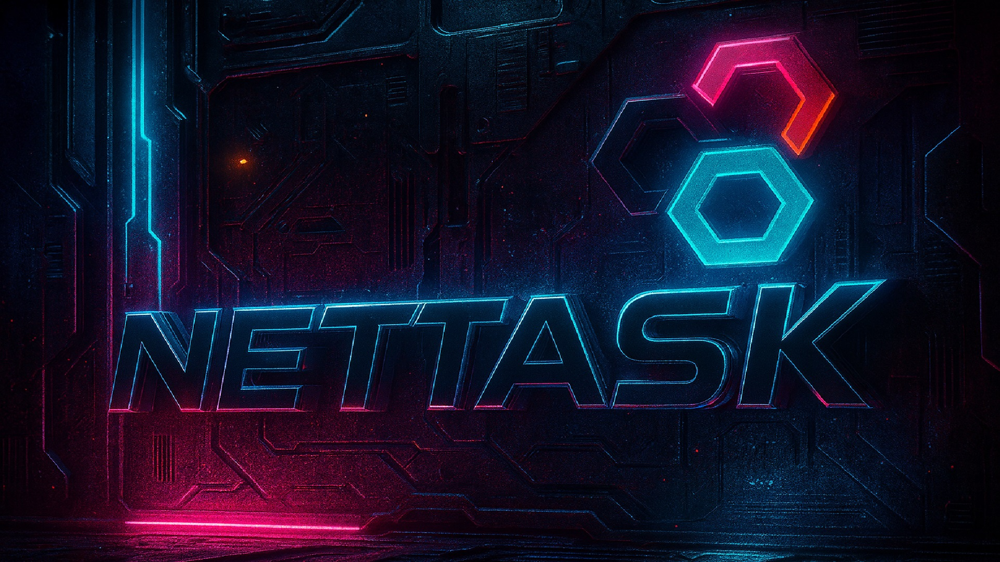

## v3.0.0

+++ Improved :icon-thumbsup:
- [x] Screensaver disabled when Check-In/Check-Out is enabled.
- [x] Automatic invitation acceptance when using NFC.
- [x] Improve the standard size for the events block.
- [x] Enhance Speed and availability.

+++ Fixed :icon-bug:
- [x] Screensaver layout and behavior corrected.
- [x] Classic and Modern theme corrected.
- [x] Improve Switching between Classic and Modern view .
- [x] Double screensaver issue resolved.
- [x] Design adjustments for 7-inch display.
+++
